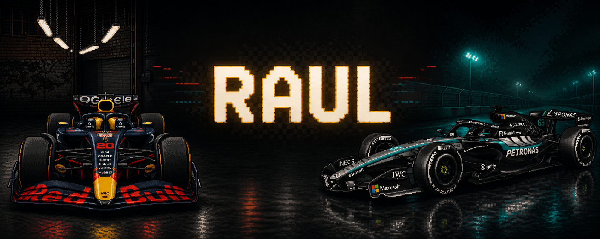

  

<h1 align="center">RAUL</h1>

  Desenvolvedor full-stack com foco em aplicações web, dados, automação e infraestrutura.

  

## Stack

### Linguagens e ecossistema

  
  
  
  

### Front-end

  
  

### Back-end e APIs

  
  
  

### Bancos de dados

  
  
  

> MongoDB é usado no VARD e está em avaliação de migração.

### Cloud, DevOps e redes

  
  
  

## GitHub em números

  
  

  

  

  <i>Construindo soluções, uma volta de cada vez.</i>

